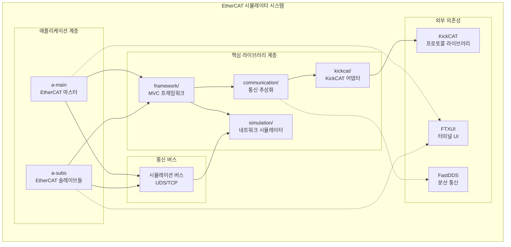
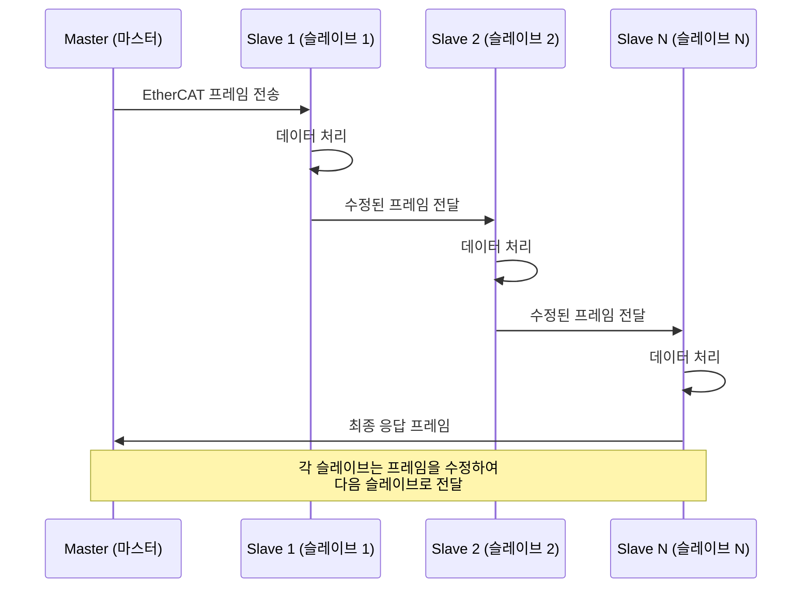
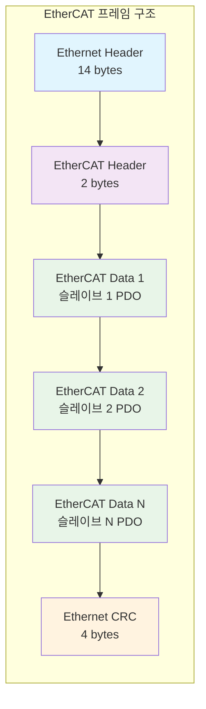
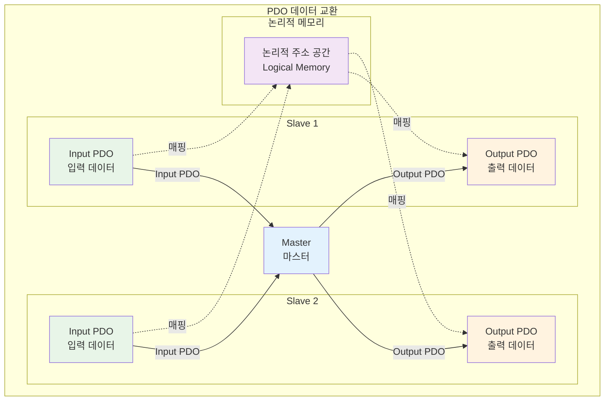
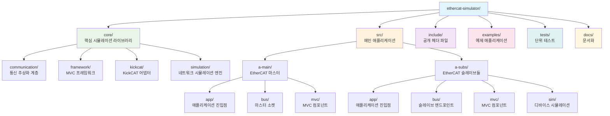
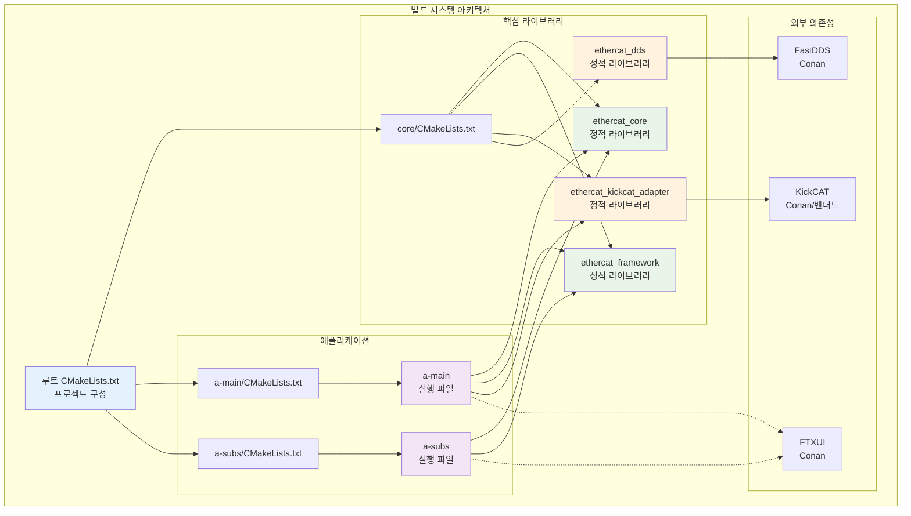
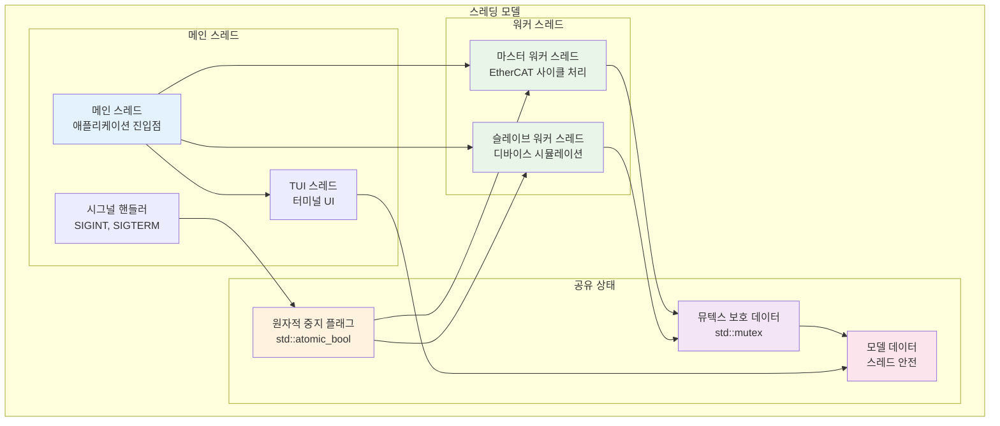
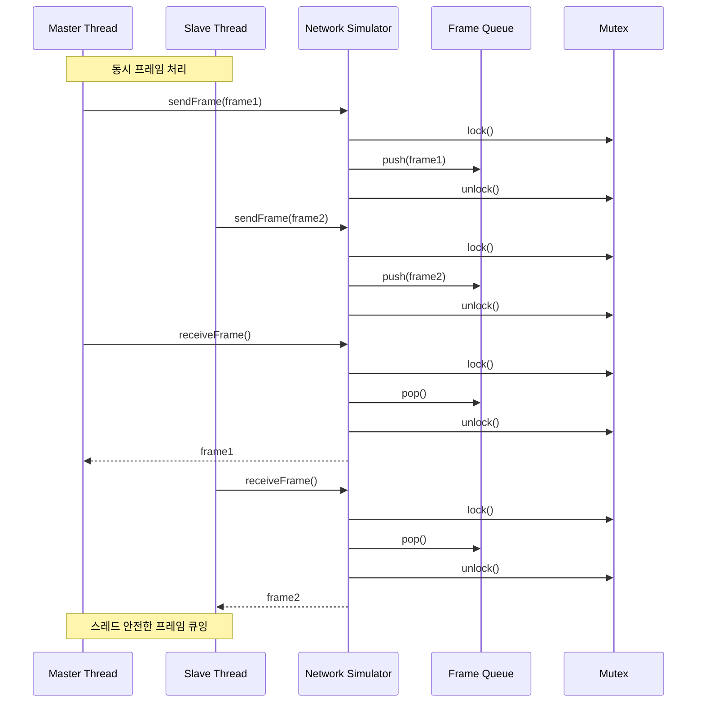

# EtherCAT 시뮬레이터 아키텍처

## 개요

EtherCAT 시뮬레이터는 EtherCAT 네트워크를 위한 포괄적인 시뮬레이션 프레임워크로, 핵심 시뮬레이션 로직, 통신 계층, 애플리케이션별 컴포넌트 간의 관심사 분리(Separation of Concerns)를 통해 모듈화된 아키텍처로 설계되었습니다. 이 아키텍처는 명확한 관심사 분리와 의존성 주입 패턴을 통해 현대적인 C++17+ 관례를 따릅니다.

## EtherCAT 기본 개념

### EtherCAT란?

EtherCAT(Ethernet for Control Automation Technology)는 실시간 산업용 이더넷 통신 프로토콜입니다. 기존의 이더넷 프레임을 수정하여 고성능 실시간 통신을 제공하며, 특히 자동화 시스템에서 널리 사용됩니다.

### 시스템 전체 개요



### EtherCAT의 주요 특징

1. **실시간 성능**: 마이크로초 단위의 결정적 지연시간
2. **효율적인 데이터 전송**: 프레임 내에서 여러 슬레이브와 동시 통신
3. **토폴로지 유연성**: 선형, 트리, 스타 등 다양한 네트워크 구조 지원
4. **동기화**: 분산 클록(Distributed Clock)을 통한 정밀한 시간 동기화
5. **확장성**: 최대 65,535개의 슬레이브 디바이스 지원

### 최근 구현 업데이트

- **AL 상태 머신 고도화**: `VirtualSlave`가 EtherCAT AL 상태 전이(INIT ↔ PRE-OP ↔ SAFE-OP ↔ OP)를 인지하도록 구현되었습니다. PRE-OP 진입까지는 자동화돼 있으며, SAFE-OP/OP 전이는 향후 PDO 구성 로직과 연동될 예정입니다.
- **공통 CLI 런타임**: 마스터/슬레이브 앱이 `cli_runtime.h`를 통해 신호 처리, 터미널 ESC 감지, headless 모드를 공유합니다. 기본 실행은 headless이며 `tui` 인자를 주면 FTXUI 대시보드를 실행합니다.
- **자동 시퀀스**: `a-main.sh` 실행 시 기본적으로 스캔 → PRE-OP → OP 시퀀스를 수행합니다. `--no-auto`를 전달하면 수동 제어 모드로 전환됩니다.

### EtherCAT 통신 구조



### EtherCAT 프레임 구조

EtherCAT 프레임은 다음과 같은 구조를 가집니다:



- **EtherCAT Header**: 통신 제어 정보
- **EtherCAT Data**: 각 슬레이브별 데이터 (PDO - Process Data Object)
- **Working Counter**: 프레임이 처리된 슬레이브 수를 추적

### PDO (Process Data Object)

PDO는 실시간 데이터 교환을 위한 EtherCAT의 핵심 메커니즘입니다:



- **Input PDO**: 슬레이브에서 마스터로 전송되는 데이터
- **Output PDO**: 마스터에서 슬레이브로 전송되는 데이터
- **매핑**: 논리적 주소와 물리적 슬레이브 간의 데이터 매핑

## 핵심 아키텍처 원칙

- **모듈화 설계**: 핵심 라이브러리, 애플리케이션, 선택적 컴포넌트 간의 명확한 분리
- **MVC 패턴**: 애플리케이션을 위한 Model-View-Controller 아키텍처
- **의존성 주입**: 소켓 생성 및 컴포넌트 인스턴스화를 위한 팩토리 패턴
- **스레드 안전성**: 원자적 연산 및 뮤텍스로 보호되는 공유 상태
- **RAII**: 스마트 포인터와 RAII 원칙을 통한 리소스 관리

## 디렉토리 구조



## 핵심 라이브러리 (`core/`)

### 1. 통신 계층 (`core/communication/`)

**목적**: 다양한 통신 프로토콜과 소켓 관리를 위한 추상화를 제공합니다.

**주요 컴포넌트**:
- `SocketFactory`: 엔드포인트 타입(TCP/UDS)에 따른 소켓 생성을 위한 팩토리 패턴
- `EndpointParser`: 엔드포인트 문자열 파싱 (예: `uds:///tmp/socket`, `tcp://host:port`)
- `DdsTextType`: 분산 통신을 위한 FastDDS 통합 (선택적)

**아키텍처**:
```cpp
class SocketFactory {
    // 엔드포인트 문자열을 기반으로 소켓 생성
    static int createSocket(const std::string& endpoint);
    
    // 특정 프로토콜 타입에 대한 소켓 생성기 등록
    static void registerCreator(const std::string& type, SocketCreator creator);
    
    // 지원되는 프로토콜 타입 확인
    static bool isSupported(const std::string& endpoint);
};
```

**구현 세부사항**:
- Unix Domain Socket (UDS)와 TCP 소켓 지원
- 엔드포인트 URL 파싱 (`uds://`, `tcp://` 스키마)
- 동적 소켓 생성기 등록 시스템
- 에러 처리 및 예외 안전성 보장

### 2. 프레임워크 계층 (`core/framework/`)

**목적**: MVC 아키텍처와 애플리케이션 생명주기 관리를 위한 기본 클래스를 제공합니다.

**주요 컴포넌트**:
- `BaseApplication`: 공통 애플리케이션 생명주기 (시그널 처리, 터미널 설정)
- `BaseController<T>`: 워커 스레드 관리가 포함된 컨트롤러용 템플릿 기본 클래스
- `BaseModel<T>`: 옵저버 패턴이 포함된 모델용 템플릿 기본 클래스
- `Observable<T>`: 모델 업데이트를 위한 옵저버 패턴 구현

**아키텍처**:
```cpp
template<typename ModelType>
class BaseController {
public:
    // 워커 스레드 시작
    void start() {
        if (worker_thread_.joinable()) return; // 이미 실행 중
        stop_flag_.store(false);
        worker_thread_ = std::thread(&BaseController::run, this);
    }
    
    // 워커 스레드 중지
    void stop() {
        stop_flag_.store(true);
        if (worker_thread_.joinable()) {
            worker_thread_.join();
        }
    }
    
    // 순수 가상 워커 함수 - 파생 클래스에서 구현
    virtual void run() = 0;
    
protected:
    // 중지 요청 확인
    bool shouldStop() const { return stop_flag_.load(); }
    
    // 중지 플래그를 존중하는 대기
    void sleepFor(std::chrono::milliseconds duration);
    
private:
    std::atomic_bool stop_flag_{false};
    std::thread worker_thread_;
};

template<typename DataType>
class BaseModel : public Observable<DataType> {
public:
    // 현재 데이터 스냅샷 가져오기 (스레드 안전)
    Data snapshot() const {
        std::lock_guard<std::mutex> lock(mutex_);
        return data_;
    }
    
    // 데이터 업데이트 및 옵저버 알림
    void updateData(const Data& newData) {
        {
            std::lock_guard<std::mutex> lock(mutex_);
            data_ = newData;
        }
        this->notifyObservers(data_);
    }
    
protected:
    mutable std::mutex mutex_;
    Data data_{};
};
```

**옵저버 패턴 구현**:
```cpp
template<typename T>
class Observable {
public:
    using Observer = std::function<void(const T&)>;
    
    // 옵저버 추가
    void addObserver(Observer observer) {
        std::lock_guard<std::mutex> lock(mutex_);
        observers_.push_back(std::move(observer));
    }
    
    // 옵저버 제거
    void removeObserver(const Observer& observer);
    
protected:
    // 모든 옵저버에게 알림
    void notifyObservers(const T& data) {
        std::lock_guard<std::mutex> lock(mutex_);
        for (const auto& observer : observers_) {
            observer(data);
        }
    }
    
private:
    mutable std::mutex mutex_;
    std::vector<Observer> observers_;
};
```

### 3. 시뮬레이션 엔진 (`core/simulation/`)

**목적**: EtherCAT 네트워크 시뮬레이션의 핵심 로직을 담당합니다.

**주요 컴포넌트**:
- `NetworkSimulator`: 가상 슬레이브와 네트워크 상태를 관리하는 메인 시뮬레이션 엔진
- 스테이션 주소를 통한 가상 슬레이브 관리
- 구성 가능한 지연시간을 가진 프레임 큐잉
- PDO 데이터를 위한 논리적 메모리 매핑

**아키텍처**:
```cpp
class NetworkSimulator {
public:
    // 슬레이브 관리
    void setVirtualSlaveCount(std::size_t n);
    void addVirtualSlave(std::shared_ptr<VirtualSlave> slave);
    void clearSlaves();
    
    // 프레임 처리
    bool sendFrame(const EtherCATFrame& frame);
    bool receiveFrame(EtherCATFrame& out);
    
    // 메모리 연산
    bool writeToSlave(std::uint16_t station_address, std::uint16_t reg, 
                     const std::uint8_t* data, std::size_t len);
    bool readFromSlave(std::uint16_t station_address, std::uint16_t reg, 
                      std::uint8_t* out, std::size_t len);
    
    // 논리적 메모리 연산
    bool writeLogical(std::uint32_t logical_address, const std::uint8_t* data, std::size_t len);
    bool readLogical(std::uint32_t logical_address, std::uint8_t* out, std::size_t len);
    
    // 디지털 입력 매핑
    void mapDigitalInputs(const std::shared_ptr<VirtualSlave>& slave,
                        std::uint32_t logical_address,
                        std::size_t width_bytes);
    
    // 네트워크 상태 설정
    void setLinkUp(bool up);
    void setLatencyMs(std::uint32_t ms);
    
    // 통계 정보
    std::size_t onlineSlaveCount() const;
    
private:
    mutable std::mutex mutex_;
    std::vector<std::shared_ptr<VirtualSlave>> slaves_;
    std::deque<FrameItem> queue_;  // 지연시간이 적용된 프레임 큐
    std::vector<std::uint8_t> logical_;  // 논리적 메모리 공간
    std::vector<InputMap> input_maps_;  // 디지털 입력 매핑
    bool linkUp_{true};
    std::uint32_t latencyMs_{0};
    std::size_t virtualSlaveCount_{0};
};
```

**프레임 큐잉 메커니즘**:
```cpp
struct FrameItem {
    communication::EtherCATFrame frame;
    std::chrono::steady_clock::time_point ready_at;
};

// 프레임 전송 시 지연시간 적용
bool NetworkSimulator::sendFrame(const EtherCATFrame& frame) {
    if (!linkUp_) return false;
    
    auto now = std::chrono::steady_clock::now();
    FrameItem item;
    item.frame = frame;
    item.ready_at = now + std::chrono::milliseconds(latencyMs_);
    
    std::lock_guard<std::mutex> lock(mutex_);
    queue_.push_back(std::move(item));
    return true;
}

// 지연시간이 지난 프레임만 수신
bool NetworkSimulator::receiveFrame(EtherCATFrame& out) {
    if (!linkUp_) return false;
    
    auto now = std::chrono::steady_clock::now();
    std::lock_guard<std::mutex> lock(mutex_);
    
    if (queue_.empty()) return false;
    
    auto& item = queue_.front();
    if (now < item.ready_at) return false;  // 아직 시간이 안 됨
    
    out = item.frame;
    queue_.pop_front();
    return true;
}
```

### 4. KickCAT 어댑터 (`core/kickcat/`)

**목적**: KickCAT 라이브러리와 시뮬레이션 환경 간의 통합 계층을 제공합니다.

**주요 컴포넌트**:
- `SimSocket`: KickCAT 통합을 위한 커스텀 소켓 구현
- KickCAT의 소켓 인터페이스를 시뮬레이션 네트워크와 연결

**KickCAT 통합**:
```cpp
class SimSocket : public kickcat::Socket {
public:
    // KickCAT 소켓 인터페이스 구현
    int open(const std::string& interface) override;
    int close() override;
    int read(void* buffer, int size) override;
    int write(const void* buffer, int size) override;
    
private:
    std::shared_ptr<NetworkSimulator> simulator_;
    std::string endpoint_;
};
```

## 메인 애플리케이션 (`src/`)

### 1. EtherCAT 마스터 (`src/a-main/`)

**목적**: 슬레이브 디바이스를 제어하고 모니터링하기 위한 EtherCAT 마스터 기능을 구현합니다.

**아키텍처**:
```
a-main/
├── app/main.cpp              # 애플리케이션 진입점
├── bus/main_socket.cpp       # 마스터 측 소켓 구현
├── mvc/
│   ├── controller/
│   │   └── main_controller.cpp    # 마스터 컨트롤러 로직
│   ├── model/
│   │   └── main_model.h          # 마스터 데이터 모델
│   └── view/
│       └── main_tui.cpp           # 터미널 UI (선택적)
```

**주요 기능**:
- 구성 가능한 타이밍을 가진 EtherCAT 사이클 관리
- 가상 슬레이브와의 실시간 통신
- 모니터링 및 제어를 위한 선택적 TUI
- 우아한 종료를 위한 시그널 처리

**컨트롤러 로직**:
```cpp
class MainController : public BaseController<MainModel> {
public:
    MainController(const std::string& endpoint, int cycle_us)
        : endpoint_(endpoint), cycle_us_(cycle_us) {}
    
    void run() override {
        // KickCAT 마스터 초기화
        auto master = std::make_unique<kickcat::Master>();
        master->open(endpoint_);
        
        while (!shouldStop()) {
            // EtherCAT 사이클 처리
            processEtherCATCycle(*master);
            
            // 사이클 간격 대기
            sleepFor(std::chrono::microseconds(cycle_us_));
        }
        
        master->close();
    }
    
private:
    void processEtherCATCycle(kickcat::Master& master) {
        // 1. 슬레이브 스캔 (필요시)
        if (needsScan()) {
            master.scan();
            updateSlaveList();
        }
        
        // 2. PDO 데이터 교환
        master.exchangePDO();
        
        // 3. 상태 모니터링
        monitorSlaveStates();
        
        // 4. 모델 업데이트
        updateModel();
    }
    
    std::string endpoint_;
    int cycle_us_;
};
```

**EtherCAT 사이클 처리 단계**:
1. **슬레이브 스캔**: 네트워크에서 슬레이브 디바이스 발견
2. **PDO 교환**: 실시간 데이터 읽기/쓰기
3. **상태 모니터링**: 슬레이브 상태 확인
4. **에러 처리**: 통신 오류 및 슬레이브 오류 처리

### 2. EtherCAT 슬레이브 (`src/a-subs/`)

**목적**: 시뮬레이션을 위한 가상 EtherCAT 슬레이브 디바이스를 구현합니다.

**아키텍처**:
```
a-subs/
├── app/main.cpp              # 애플리케이션 진입점
├── bus/subs_endpoint.cpp     # 슬레이브 측 엔드포인트 구현
├── mvc/
│   ├── controller/
│   │   └── subs_controller.cpp    # 슬레이브 컨트롤러 로직
│   ├── model/
│   │   └── subs_model.h           # 슬레이브 데이터 모델
│   └── view/
│       └── subs_tui.cpp          # 터미널 UI (선택적)
└── sim/
    └── el1258_subs.h             # 특정 슬레이브 디바이스 시뮬레이션
```

**주요 기능**:
- 여러 가상 슬레이브 인스턴스
- 디바이스별 시뮬레이션 (예: EL1258 디지털 입력 모듈)
- 마스터 명령에 대한 실시간 응답
- 슬레이브 상태 모니터링을 위한 선택적 TUI

**EL1258 디지털 입력 모듈 시뮬레이션**:
```cpp
class EL1258Subs : public VirtualSlave {
public:
    EL1258Subs(std::uint16_t address) 
        : VirtualSlave(address, 0x00000002, 0x001C0E52, "EL1258") {
        // EL1258 특정 초기화
        initializeDigitalInputs();
    }
    
    // 디지털 입력 상태 읽기
    bool readDigitalInputsBitfield(uint32_t& bits) override {
        bits = digital_inputs_;
        return true;
    }
    
    // 외부에서 입력 상태 설정 (시뮬레이션용)
    void setDigitalInput(int channel, bool state) {
        if (channel >= 0 && channel < 8) {
            if (state) {
                digital_inputs_ |= (1 << channel);
            } else {
                digital_inputs_ &= ~(1 << channel);
            }
        }
    }
    
private:
    void initializeDigitalInputs() {
        // PDO 매핑 설정
        // Input PDO: 8비트 디지털 입력
        // Output PDO: 없음 (입력 전용 모듈)
    }
    
    uint32_t digital_inputs_{0};  // 8채널 디지털 입력 상태
};
```

**슬레이브 컨트롤러 로직**:
```cpp
class SubsController : public BaseController<SubsModel> {
public:
    SubsController(const std::string& endpoint, int slave_count)
        : endpoint_(endpoint), slave_count_(slave_count) {}
    
    void run() override {
        // 네트워크 시뮬레이터 초기화
        auto simulator = std::make_shared<NetworkSimulator>();
        
        // 가상 슬레이브 생성
        for (int i = 0; i < slave_count_; ++i) {
            auto slave = std::make_shared<EL1258Subs>(i + 1);
            simulator->addVirtualSlave(slave);
            slaves_.push_back(slave);
        }
        
        // 시뮬레이션 루프
        while (!shouldStop()) {
            // 프레임 처리
            processIncomingFrames(simulator);
            
            // 디바이스 상태 업데이트
            updateDeviceStates();
            
            // 모델 업데이트
            updateModel();
            
            sleepFor(std::chrono::milliseconds(1));
        }
    }
    
private:
    void processIncomingFrames(std::shared_ptr<NetworkSimulator> simulator) {
        EtherCATFrame frame;
        while (simulator->receiveFrame(frame)) {
            // 프레임 처리 로직
            processFrame(frame, simulator);
        }
    }
    
    void updateDeviceStates() {
        // 디바이스별 상태 업데이트
        for (auto& slave : slaves_) {
            if (auto el1258 = std::dynamic_pointer_cast<EL1258Subs>(slave)) {
                // 디지털 입력 상태 시뮬레이션
                simulateDigitalInputs(el1258);
            }
        }
    }
    
    std::string endpoint_;
    int slave_count_;
    std::vector<std::shared_ptr<VirtualSlave>> slaves_;
};
```

## 빌드 시스템 아키텍처

### CMake 구조



빌드 시스템은 계층적 CMake 구조를 사용합니다:

1. **루트 CMakeLists.txt**: 프로젝트 구성, 의존성 관리, 기능 플래그
2. **핵심 라이브러리**: `core/CMakeLists.txt`가 정적 라이브러리 빌드:
   - `ethercat_core`: 핵심 시뮬레이션 및 통신
   - `ethercat_framework`: MVC 프레임워크 기본 클래스
   - `ethercat_kickcat_adapter`: KickCAT 통합 (선택적)
   - `ethercat_dds`: FastDDS 통합 (선택적)

3. **애플리케이션**: 각 애플리케이션마다 자체 CMakeLists.txt:
   - `src/a-main/CMakeLists.txt`: 마스터 애플리케이션
   - `src/a-subs/CMakeLists.txt`: 슬레이브 애플리케이션

### 의존성 관리

- **KickCAT**: 필수 EtherCAT 프로토콜 라이브러리 (Conan 또는 벤더드)
- **FTXUI**: 선택적 터미널 UI 라이브러리 (Conan)
- **FastDDS**: 선택적 분산 통신 (Conan)

**Conan 의존성 관리**:
```python
# conanfile.py
class EtherCATSimulatorConan(ConanFile):
    requires = [
        "kickcat/1.0.0",  # EtherCAT 프로토콜 라이브러리
        "ftxui/4.0.0",    # 터미널 UI (선택적)
        "fastdds/2.10.0", # 분산 통신 (선택적)
    ]
    
    def configure(self):
        self.options["ftxui"].shared = False
        self.options["fastdds"].shared = False
```

## 통신 흐름

### 마스터-슬레이브 통신

1. **마스터 (`a-main`)**:
   - 시뮬레이션 버스에 소켓 연결 생성
   - KickCAT를 통해 EtherCAT 프레임 전송
   - 응답 수신 및 슬레이브 데이터 처리

2. **슬레이브 (`a-subs`)**:
   - 동일한 시뮬레이션 버스에 연결
   - 마스터로부터 EtherCAT 프레임 수신
   - 명령 처리 및 가상 디바이스 상태 업데이트
   - 마스터로 응답 전송

3. **시뮬레이션 버스**:
   - Unix Domain Socket (`uds:///tmp/ethercat_bus.sock`) 또는 TCP
   - 구성 가능한 지연시간을 가진 프레임 큐잉
   - 가상 슬레이브 레지스트리 및 주소 지정

### 데이터 흐름 아키텍처

```mermaid
graph TB
    subgraph "데이터 흐름"
        MASTER_APP[마스터 애플리케이션<br/>a-main]
        KICKCAT_LIB[KickCAT 라이브러리<br/>프로토콜 처리]
        SIM_BUS[시뮬레이션 버스<br/>UDS/TCP]
        NET_SIM[네트워크 시뮬레이터<br/>프레임 처리]
        VIRTUAL_SLAVES[가상 슬레이브들<br/>디바이스 시뮬레이션]
        DEVICES[EL1258/기타 디바이스들<br/>실제 디바이스 모델]
    end
    
    MASTER_APP -->|EtherCAT 프레임| KICKCAT_LIB
    KICKCAT_LIB -->|소켓 I/O| SIM_BUS
    SIM_BUS -->|프레임 처리| NET_SIM
    NET_SIM -->|슬레이브 연산| VIRTUAL_SLAVES
    VIRTUAL_SLAVES -->|디바이스 시뮬레이션| DEVICES
    
    DEVICES -.->|응답 데이터| VIRTUAL_SLAVES
    VIRTUAL_SLAVES -.->|응답 프레임| NET_SIM
    NET_SIM -.->|응답 프레임| SIM_BUS
    SIM_BUS -.->|응답 프레임| KICKCAT_LIB
    KICKCAT_LIB -.->|응답 데이터| MASTER_APP
    
    style MASTER_APP fill:#e3f2fd
    style KICKCAT_LIB fill:#e8f5e8
    style SIM_BUS fill:#fff3e0
    style NET_SIM fill:#f3e5f5
    style VIRTUAL_SLAVES fill:#fce4ec
    style DEVICES fill:#e0f2f1
```



**상세 통신 흐름**:

1. **마스터에서 슬레이브로**:
   ```
   마스터 → KickCAT → 소켓 → 시뮬레이터 → 가상 슬레이브
   ```

2. **슬레이브에서 마스터로**:
   ```
   가상 슬레이브 → 시뮬레이터 → 소켓 → KickCAT → 마스터
   ```

3. **프레임 처리 과정**:
   - 프레임 수신 및 파싱
   - 슬레이브별 데이터 추출
   - 디바이스별 명령 처리
   - 응답 데이터 생성
   - 프레임 재구성 및 전송

## 스레딩 모델

### 컨트롤러 스레딩



- 각 애플리케이션은 전용 워커 스레드가 있는 `BaseController` 사용
- 우아한 종료를 위한 원자적 중지 플래그
- 뮤텍스 보호로 스레드 안전한 모델 업데이트

**스레드 안전성 보장**:
```cpp
class BaseController {
private:
    std::atomic_bool stop_flag_{false};  // 원자적 중지 플래그
    std::thread worker_thread_;         // 워커 스레드
    
public:
    void start() {
        stop_flag_.store(false);
        worker_thread_ = std::thread(&BaseController::run, this);
    }
    
    void stop() {
        stop_flag_.store(true);  // 원자적 쓰기
        if (worker_thread_.joinable()) {
            worker_thread_.join();
        }
    }
    
protected:
    bool shouldStop() const {
        return stop_flag_.load();  // 원자적 읽기
    }
};
```

### 통신 스레딩



- 소켓 연산은 스레드 안전
- 프레임 큐잉은 뮤텍스로 보호되는 컨테이너 사용
- 옵저버 패턴 알림은 스레드 안전

**뮤텍스 보호 예시**:
```cpp
class NetworkSimulator {
private:
    mutable std::mutex mutex_;
    std::vector<std::shared_ptr<VirtualSlave>> slaves_;
    
public:
    bool writeToSlave(std::uint16_t addr, std::uint16_t reg, 
                     const std::uint8_t* data, std::size_t len) {
        std::lock_guard<std::mutex> lock(mutex_);  // 자동 락 해제
        // 슬레이브 쓰기 연산
        return performWrite(addr, reg, data, len);
    }
};
```

## 구성 및 런타임

### 명령줄 인터페이스

**마스터 (`a-main`)**:
```bash
a-main [--uds PATH | --tcp HOST:PORT] [--cycle us]
```

**슬레이브 (`a-subs`)**:
```bash
a-subs [--uds PATH | --tcp HOST:PORT] [--count N]
```

**매개변수 설명**:
- `--uds PATH`: Unix Domain Socket 경로 (기본값: `/tmp/ethercat_bus.sock`)
- `--tcp HOST:PORT`: TCP 연결 (예: `localhost:8080`)
- `--cycle us`: EtherCAT 사이클 시간 (마이크로초, 기본값: 1000)
- `--count N`: 가상 슬레이브 개수 (기본값: 1)

### 런타임 기능

- **시그널 처리**: SIGINT, SIGTERM, SIGTSTP
- **ESC 키 지원**: 우아한 종료
- **터미널에서 실행 시 선택적 TUI**
- **CI/CD용 스모크 테스트 모드**

**시그널 처리 구현**:
```cpp
int main(int argc, char** argv) {
    static std::atomic_bool stop{false};
    
    // 시그널 핸들러 설정
    auto on_signal = [](int){ stop.store(true); };
    struct sigaction sa{};
    sa.sa_handler = on_signal;
    sigemptyset(&sa.sa_mask);
    sa.sa_flags = 0;
    
    sigaction(SIGINT, &sa, nullptr);   // Ctrl+C
    sigaction(SIGTERM, &sa, nullptr);  // 종료 신호
    sigaction(SIGTSTP, &sa, nullptr);  // Ctrl+Z
    std::signal(SIGPIPE, SIG_IGN);     // 파이프 오류 무시
    
    // 애플리케이션 실행
    auto controller = std::make_shared<MainController>(endpoint, cycle_us);
    controller->start();
    
    // 메인 루프
    while (!stop.load()) {
        // ESC 키 확인 또는 대기
        if (checkEscapeKey()) {
            stop.store(true);
            break;
        }
        std::this_thread::sleep_for(std::chrono::milliseconds(200));
    }
    
    controller->stop();
    return 0;
}
```

## 확장 지점

### 새로운 슬레이브 타입 추가

1. `src/a-subs/sim/`에 디바이스별 헤더 생성
2. 컨트롤러에서 가상 슬레이브 동작 구현
3. 디바이스별 PDO 매핑 추가

**새 슬레이브 타입 예시**:
```cpp
// sim/el2004_subs.h
class EL2004Subs : public VirtualSlave {
public:
    EL2004Subs(std::uint16_t address) 
        : VirtualSlave(address, 0x00000002, 0x00000008, "EL2004") {
        initializeDigitalOutputs();
    }
    
    // 디지털 출력 상태 쓰기
    bool writeDigitalOutputsBitfield(uint32_t bits) override {
        digital_outputs_ = bits;
        return true;
    }
    
private:
    void initializeDigitalOutputs() {
        // Output PDO: 8비트 디지털 출력
        // Input PDO: 없음 (출력 전용 모듈)
    }
    
    uint32_t digital_outputs_{0};
};
```

### 새로운 통신 프로토콜 추가

1. `SocketFactory`를 새로운 생성기로 확장
2. 프로토콜별 소켓 처리 구현
3. 새로운 URL 스키마에 대한 엔드포인트 파서 업데이트

**새 프로토콜 예시**:
```cpp
// UDP 프로토콜 추가
SocketFactory::registerCreator("udp", [](const std::string& endpoint) {
    // UDP 소켓 생성 로직
    return createUDPSocket(endpoint);
});

// 사용법: udp://192.168.1.100:8080
```

### 새로운 애플리케이션 추가

1. `src/`에서 MVC 패턴 따르기
2. `BaseController`와 `BaseModel`에서 상속
3. 기존 패턴을 따르는 CMakeLists.txt 추가

## 테스트 아키텍처

- **단위 테스트**: GoogleTest를 사용한 `tests/`의 단위 테스트
- **통합 테스트**: `examples/`의 예제 애플리케이션
- **스모크 테스트**: CI/CD 검증용
- **커버리지 보고**: GCC/Clang 지원

**테스트 구조**:
```
tests/
├── test_communication.cpp    # 통신 계층 테스트
├── test_simulation.cpp       # 시뮬레이션 엔진 테스트
├── test_framework.cpp        # 프레임워크 테스트
└── test_integration.cpp      # 통합 테스트
```

**테스트 실행**:
```bash
# 테스트 빌드 및 실행
./test.sh

# 커버리지 포함 테스트
cmake -DENABLE_COVERAGE=ON ..
make
ctest --output-on-failure
```

## 성능 고려사항

### 실시간 성능

- **원자적 연산**: 락-프리 데이터 구조 사용
- **메모리 풀**: 동적 할당 최소화
- **CPU 친화적**: 캐시 효율적인 데이터 구조

### 메모리 관리

- **RAII**: 스마트 포인터를 통한 자동 메모리 관리
- **예외 안전성**: 강력한 예외 보장
- **리소스 누수 방지**: 자동 리소스 해제

### 확장성

- **모듈화**: 독립적인 컴포넌트
- **플러그인 아키텍처**: 동적 로딩 지원
- **설정 가능성**: 런타임 구성 변경

이 아키텍처는 명확한 관심사 분리, 확장성, 유지보수성을 제공하는 EtherCAT 시뮬레이션을 위한 견고한 기반을 제공합니다.
