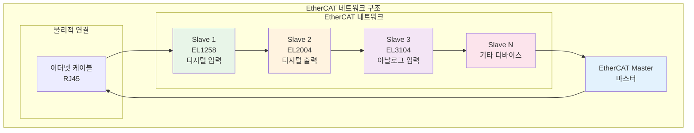
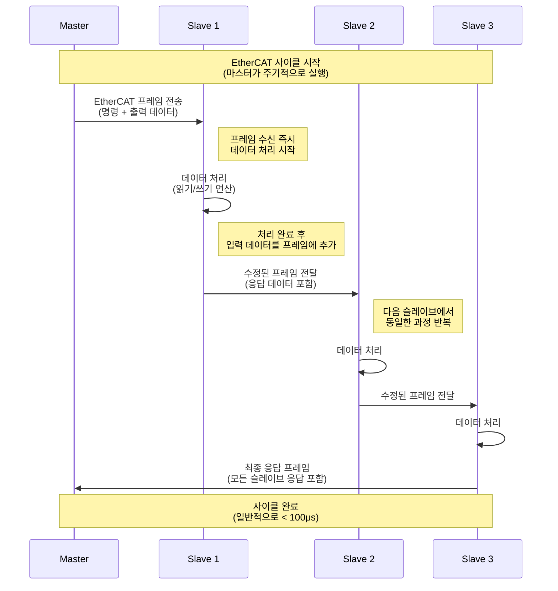
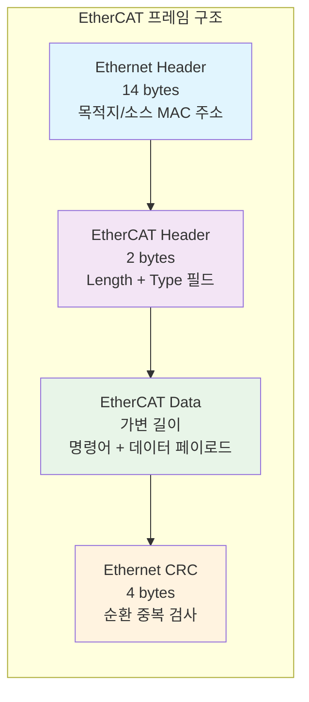
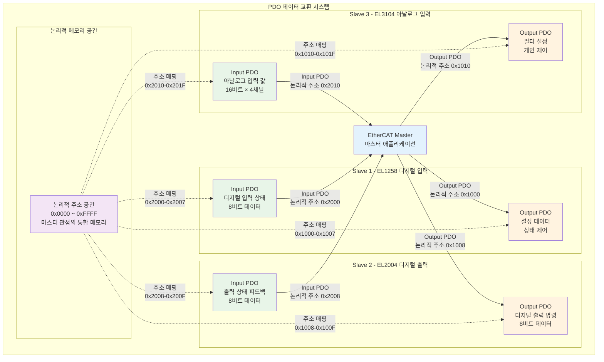
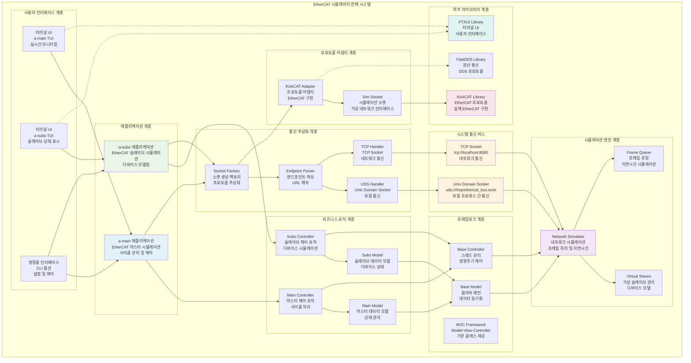
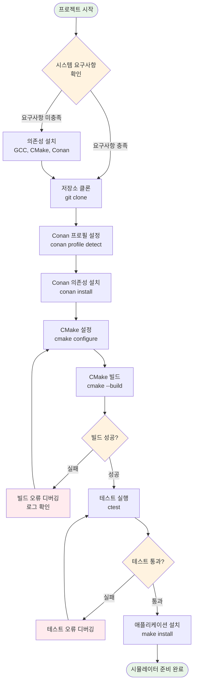
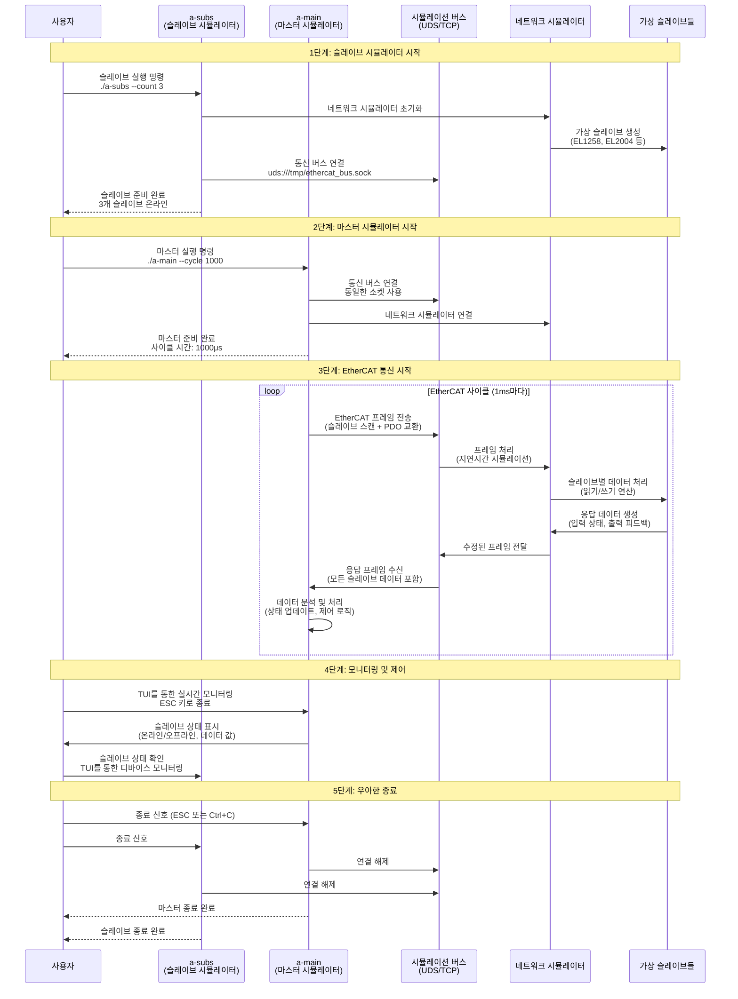

# EtherCAT 시뮬레이터 완전 가이드

## 목차
1. [EtherCAT 프로토콜 완전 이해](#ethercat-프로토콜-완전-이해)
2. [시뮬레이터 아키텍처 상세 분석](#시뮬레이터-아키텍처-상세-분석)
3. [빌드 및 설치 완전 가이드](#빌드-및-설치-완전-가이드)
4. [사용법 상세 설명](#사용법-상세-설명)
5. [실제 예제 및 시나리오](#실제-예제-및-시나리오)
6. [고급 설정 및 커스터마이징](#고급-설정-및-커스터마이징)
7. [문제 해결 및 디버깅](#문제-해결-및-디버깅)

## EtherCAT 프로토콜 완전 이해

### EtherCAT란 무엇인가?

EtherCAT(Ethernet for Control Automation Technology)는 현대 산업 자동화 분야에서 널리 사용되는 실시간 이더넷 통신 프로토콜입니다. 이 프로토콜은 기존의 표준 이더넷 기술을 기반으로 하되, 산업용 자동화 시스템에서 요구되는 극도로 빠른 응답 시간과 높은 정확성을 제공하도록 특별히 설계되었습니다. EtherCAT의 가장 큰 특징은 마이크로초 단위의 결정적 지연시간을 보장하면서도, 기존 이더넷 인프라를 그대로 활용할 수 있다는 점입니다.

전통적인 이더넷 통신에서는 각 디바이스가 개별적으로 프레임을 처리하고 응답을 보내는 방식이었지만, EtherCAT는 혁신적인 "온더플라이(On-the-fly)" 처리 방식을 도입하여 하나의 프레임이 네트워크를 순회하면서 모든 슬레이브 디바이스의 데이터를 동시에 처리할 수 있게 했습니다. 이는 네트워크 효율성을 극대화하고 통신 지연시간을 최소화하는 핵심 기술입니다.



### EtherCAT의 핵심 특징과 기술적 우위

#### 1. 실시간 성능의 혁신적 구현

EtherCAT의 가장 중요한 특징은 마이크로초 단위의 극도로 빠른 응답 시간을 보장한다는 점입니다. 일반적인 EtherCAT 네트워크에서는 100마이크로초 이하의 결정적 지연시간을 달성할 수 있으며, 이는 기존의 다른 산업용 통신 프로토콜들과 비교했을 때 혁신적인 성능입니다. 이러한 빠른 응답 시간은 산업용 로봇, CNC 머신, 자동화 생산라인과 같은 실시간 제어가 필수적인 애플리케이션에서 매우 중요한 요소입니다.

또한 EtherCAT는 분산 클록(Distributed Clock) 기술을 통해 네트워크상의 모든 디바이스가 동일한 시간 기준을 공유할 수 있게 합니다. 이는 여러 슬레이브 디바이스가 정확히 동시에 동작해야 하는 복잡한 제어 시스템에서 매우 중요한 기능입니다. 예를 들어, 여러 개의 모터가 정확히 동시에 시작되거나 정지되어야 하는 경우, 분산 클록을 통해 마이크로초 단위의 정밀한 동기화가 가능합니다.

#### 2. 효율적인 데이터 전송 메커니즘

EtherCAT의 혁신적인 데이터 전송 방식은 기존의 이더넷 통신과는 완전히 다른 접근 방식을 사용합니다. 전통적인 이더넷에서는 각 디바이스가 개별적으로 프레임을 수신하고 처리한 후 별도의 응답 프레임을 전송하는 방식이었지만, EtherCAT는 하나의 프레임이 네트워크를 순회하면서 모든 슬레이브 디바이스의 데이터를 동시에 처리하는 "온더플라이" 방식을 사용합니다.

이 방식에서는 마스터가 하나의 EtherCAT 프레임을 전송하면, 이 프레임이 네트워크상의 첫 번째 슬레이브에 도착하는 순간 해당 슬레이브는 자신의 데이터를 프레임에 추가하고 즉시 다음 슬레이브로 전달합니다. 이 과정이 모든 슬레이브를 거쳐 마지막 슬레이브에서 마스터로 다시 돌아올 때까지 계속되며, 결과적으로 하나의 프레임으로 모든 슬레이브와의 데이터 교환이 완료됩니다.

#### 3. 네트워크 토폴로지의 유연성

EtherCAT는 다양한 네트워크 토폴로지를 지원하여 다양한 산업 환경에 적합한 네트워크 구성을 가능하게 합니다. 가장 일반적으로 사용되는 선형 토폴로지는 슬레이브 디바이스들을 직렬로 연결하는 방식으로, 설치가 간단하고 케이블 비용을 최소화할 수 있습니다. 트리 토폴로지는 중앙에서 여러 분기로 나뉘는 구조로, 복잡한 생산라인에서 여러 섹션을 독립적으로 제어할 때 유용합니다.

스타 토폴로지는 모든 슬레이브가 중앙의 스위치나 허브에 직접 연결되는 방식으로, 각 슬레이브의 독립적인 제어가 중요한 경우에 사용됩니다. 마지막으로 링 토폴로지는 네트워크가 순환 구조를 이루는 방식으로, 높은 신뢰성이 요구되는 애플리케이션에서 사용됩니다.

### EtherCAT 통신 원리의 상세한 작동 메커니즘

EtherCAT의 통신 원리를 이해하기 위해서는 실제 데이터가 네트워크를 통해 어떻게 흐르는지 단계별로 살펴볼 필요가 있습니다. EtherCAT 통신은 매우 정교하게 설계된 프로세스로, 각 단계가 마이크로초 단위로 정확히 실행됩니다.



EtherCAT 통신 사이클의 첫 번째 단계는 마스터가 EtherCAT 프레임을 생성하고 네트워크로 전송하는 것입니다. 이 프레임에는 각 슬레이브에 대한 명령어와 출력 데이터가 포함되어 있습니다. 마스터는 미리 정의된 주기(일반적으로 1밀리초 이하)에 따라 이 프레임을 정기적으로 전송합니다.

프레임이 첫 번째 슬레이브에 도착하면, 해당 슬레이브는 프레임을 수신하는 동시에 자신에게 할당된 명령을 즉시 처리하기 시작합니다. 이 과정에서 슬레이브는 자신의 입력 데이터를 프레임에 추가하고, 출력 데이터가 있다면 이를 자신의 레지스터에 저장합니다. 이 모든 과정은 프레임이 다음 슬레이브로 전달되기 전에 완료되어야 하므로, 각 슬레이브는 매우 빠른 처리 속도를 가져야 합니다.

이 과정이 네트워크상의 모든 슬레이브를 거쳐 마지막 슬레이브에 도달하면, 마지막 슬레이브는 모든 슬레이브의 응답 데이터가 포함된 완전한 프레임을 마스터로 다시 전송합니다. 마스터는 이 응답 프레임을 수신하여 각 슬레이브의 상태와 입력 데이터를 확인하고, 다음 사이클을 위한 준비를 합니다.

### EtherCAT 프레임 구조의 상세한 분석

EtherCAT 프레임의 구조를 이해하는 것은 EtherCAT 통신의 핵심을 파악하는 데 매우 중요합니다. EtherCAT 프레임은 표준 이더넷 프레임을 기반으로 하되, EtherCAT 통신에 특화된 헤더와 데이터 구조를 가지고 있습니다.



EtherCAT 프레임의 첫 번째 구성 요소는 표준 이더넷 헤더입니다. 이 14바이트 헤더에는 목적지 MAC 주소(6바이트), 소스 MAC 주소(6바이트), 그리고 이더넷 타입 필드(2바이트)가 포함되어 있습니다. EtherCAT의 경우 이더넷 타입 필드는 0x88A4로 설정되어 이 프레임이 EtherCAT 프레임임을 나타냅니다.

EtherCAT 헤더는 2바이트로 구성되며, 첫 번째 바이트는 EtherCAT 데이터의 길이를 나타내고, 두 번째 바이트는 프레임 타입을 나타냅니다. 이 헤더는 EtherCAT 네트워크상의 모든 디바이스가 프레임을 올바르게 처리할 수 있도록 필요한 정보를 제공합니다.

EtherCAT 데이터 섹션은 실제 명령어와 데이터가 포함되는 부분으로, 길이가 가변적입니다. 이 섹션에는 각 슬레이브에 대한 명령어, 출력 데이터, 그리고 슬레이브로부터 받은 입력 데이터가 포함됩니다. 마지막으로 이더넷 CRC는 프레임의 무결성을 보장하기 위해 사용됩니다.

### PDO (Process Data Object) 시스템의 상세한 작동 원리

PDO(Process Data Object)는 EtherCAT에서 실시간 데이터 교환을 담당하는 핵심 메커니즘입니다. PDO 시스템을 이해하기 위해서는 마스터와 슬레이브 간의 데이터 흐름, 논리적 메모리 매핑, 그리고 실시간 데이터 교환 과정을 상세히 살펴볼 필요가 있습니다.



PDO 시스템의 핵심은 논리적 메모리 매핑입니다. 마스터 애플리케이션은 물리적으로 분산된 여러 슬레이브의 데이터를 하나의 연속된 논리적 메모리 공간으로 인식할 수 있습니다. 예를 들어, 논리적 주소 0x1000부터 0x1007까지는 첫 번째 슬레이브의 출력 데이터에 매핑되고, 0x2000부터 0x2007까지는 첫 번째 슬레이브의 입력 데이터에 매핑됩니다.

이러한 매핑을 통해 마스터 애플리케이션은 복잡한 네트워크 구조를 신경 쓰지 않고도 단순한 메모리 읽기/쓰기 연산으로 모든 슬레이브와 통신할 수 있습니다. 이는 프로그래밍을 크게 단순화하고 실시간 성능을 향상시키는 중요한 요소입니다.

## 시뮬레이터 아키텍처 상세 분석

### 전체 시스템 구조와 컴포넌트 간의 상호작용

EtherCAT 시뮬레이터는 실제 EtherCAT 네트워크를 소프트웨어로 시뮬레이션하는 복합적인 시스템입니다. 이 시스템의 아키텍처를 이해하기 위해서는 각 계층의 역할과 컴포넌트 간의 상호작용을 상세히 살펴볼 필요가 있습니다.



### 시뮬레이션 원리

실제 EtherCAT 네트워크를 소프트웨어로 시뮬레이션합니다:

1. **가상 네트워크**: 실제 이더넷 대신 소켓 통신 사용
2. **가상 슬레이브**: 실제 하드웨어 대신 소프트웨어 모델
3. **프레임 시뮬레이션**: EtherCAT 프레임을 소프트웨어로 처리
4. **지연시간 모델링**: 네트워크 지연시간 시뮬레이션

## 빌드 및 설치 완전 가이드

### 시스템 요구사항과 환경 설정

EtherCAT 시뮬레이터를 성공적으로 빌드하고 실행하기 위해서는 적절한 개발 환경이 필요합니다. 이 섹션에서는 시스템 요구사항부터 실제 빌드 과정까지 단계별로 상세히 설명합니다.

#### 기본 시스템 요구사항

- **운영체제**: Linux (Ubuntu 20.04 LTS 이상 권장, CentOS 8+ 지원)
- **컴파일러**: GCC 9.0 이상 또는 Clang 10.0 이상
- **CMake**: 버전 3.20 이상 (최신 기능 활용을 위해)
- **Conan**: 버전 2.0 이상 (의존성 관리 및 패키지 빌드)
- **메모리**: 최소 4GB RAM (빌드 시 8GB 권장)
- **디스크 공간**: 최소 2GB 여유 공간 (의존성 포함 시 5GB 권장)

### 빌드 프로세스 전체 흐름



### 의존성 설치

#### Ubuntu/Debian
```bash
# 기본 개발 도구
sudo apt update
sudo apt install -y build-essential cmake git

# Conan 설치
pip install conan

# 선택적 의존성 (터미널 UI)
sudo apt install -y libncurses-dev
```

#### CentOS/RHEL
```bash
# 기본 개발 도구
sudo yum groupinstall -y "Development Tools"
sudo yum install -y cmake3 git

# Conan 설치
pip install conan

# 선택적 의존성
sudo yum install -y ncurses-devel
```

### 프로젝트 빌드

#### 1. 저장소 클론
```bash
git clone https://github.com/your-repo/ethercat-simulator.git
cd ethercat-simulator
```

#### 2. Conan 의존성 설치
```bash
# Conan 프로필 설정
conan profile detect --force

# 의존성 설치
conan install . --output-folder=build --build=missing
```

#### 3. CMake 빌드
```bash
# 빌드 디렉토리 생성
mkdir build && cd build

# CMake 설정
cmake .. -DCMAKE_TOOLCHAIN_FILE=../build/conan_toolchain.cmake

# 빌드 실행
cmake --build . --parallel
```

#### 4. 빌드 스크립트 사용 (권장)
```bash
# 전체 빌드 (Release 모드)
./build.sh

# Debug 모드 빌드
./build.sh --debug

# 클린 빌드
./build.sh --clean
```

### 빌드 옵션

```bash
# CMake 옵션 설정
cmake .. \
    -DCMAKE_BUILD_TYPE=Release \
    -DBUILD_EXAMPLES=ON \
    -DBUILD_GUI=ON \
    -DENABLE_COVERAGE=ON \
    -DFORCE_NO_FTXUI=OFF
```

**주요 옵션**:
- `BUILD_EXAMPLES`: 예제 애플리케이션 빌드
- `BUILD_GUI`: Qt GUI 애플리케이션 빌드
- `ENABLE_COVERAGE`: 코드 커버리지 활성화
- `FORCE_NO_FTXUI`: FTXUI 비활성화

## 사용법 상세 설명

### 기본 실행 과정과 시뮬레이터 동작 원리

EtherCAT 시뮬레이터를 사용하는 과정은 실제 EtherCAT 네트워크를 구성하고 운영하는 과정과 매우 유사합니다. 이 섹션에서는 시뮬레이터의 기본 실행 방법부터 고급 사용법까지 단계별로 상세히 설명합니다.

### 시뮬레이터 실행 흐름도



### 기본 실행 방법

#### 1. 슬레이브 시뮬레이터 시작 과정

슬레이브 시뮬레이터는 실제 EtherCAT 슬레이브 디바이스들의 동작을 소프트웨어로 시뮬레이션하는 애플리케이션입니다. 이 애플리케이션을 시작하면 지정된 개수만큼의 가상 슬레이브가 생성되고, 마스터의 명령을 기다리게 됩니다.

```bash
# 기본 설정으로 슬레이브 1개 실행
# 이 명령은 Unix Domain Socket을 사용하여 로컬 통신을 수행합니다
./build/src/a-subs/a-subs

# 여러 슬레이브 실행 (3개의 가상 슬레이브 생성)
# 각 슬레이브는 고유한 주소를 가지며 독립적으로 동작합니다
./build/src/a-subs/a-subs --count 3

# TCP 연결을 사용한 원격 통신
# 네트워크를 통해 다른 시스템의 마스터와 통신할 수 있습니다
./build/src/a-subs/a-subs --tcp localhost:8080 --count 2
```

#### 2. 마스터 시뮬레이터 시작 과정

마스터 시뮬레이터는 EtherCAT 네트워크의 제어 중심이 되는 애플리케이션입니다. 이 애플리케이션은 주기적으로 EtherCAT 프레임을 전송하여 슬레이브들과 통신하고, 실시간 데이터 교환을 수행합니다.

```bash
# 기본 설정으로 마스터 실행
# 기본 사이클 시간은 1000마이크로초(1밀리초)로 설정됩니다
./build/src/a-main/a-main

# 사이클 시간을 500마이크로초로 설정
# 더 빠른 응답이 필요한 애플리케이션에 적합합니다
./build/src/a-main/a-main --cycle 500

# TCP 연결을 사용한 원격 통신
# 네트워크를 통해 다른 시스템의 슬레이브들과 통신합니다
./build/src/a-main/a-main --tcp localhost:8080 --cycle 1000
```

### 고급 사용법

#### 동시 실행 스크립트
```bash
# 터미널 1: 슬레이브 실행
./build/src/a-subs/a-subs --count 3

# 터미널 2: 마스터 실행
./build/src/a-main/a-main --cycle 1000
```

#### 자동화 스크립트
```bash
# 제공된 실행 스크립트 사용
./a-subs.sh  # 슬레이브 실행
./a-main.sh  # 마스터 실행
```

### 명령줄 옵션

#### a-subs (슬레이브)
```bash
a-subs [옵션]

옵션:
  --uds PATH        Unix Domain Socket 경로 (기본: /tmp/ethercat_bus.sock)
  --tcp HOST:PORT   TCP 연결 (예: localhost:8080)
  --count N         가상 슬레이브 개수 (기본: 1)
  -h, --help        도움말 표시
```

#### a-main (마스터)
```bash
a-main [옵션]

옵션:
  --uds PATH        Unix Domain Socket 경로 (기본: /tmp/ethercat_bus.sock)
  --tcp HOST:PORT   TCP 연결 (예: localhost:8080)
  --cycle us        EtherCAT 사이클 시간 (마이크로초, 기본: 1000)
  -h, --help        도움말 표시
```

## 실제 예제

### 예제 1: 기본 디지털 입출력 시뮬레이션

#### 1단계: 슬레이브 실행
```bash
# 터미널 1에서 실행
./build/src/a-subs/a-subs --count 2
```

#### 2단계: 마스터 실행
```bash
# 터미널 2에서 실행
./build/src/a-main/a-main --cycle 1000
```

#### 3단계: 동작 확인
- 마스터가 슬레이브를 스캔하고 PDO 교환을 시작합니다
- TUI에서 실시간 상태를 모니터링할 수 있습니다
- ESC 키로 우아하게 종료할 수 있습니다

### 예제 2: 네트워크 지연시간 시뮬레이션

#### 설정 파일 생성
```json
{
  "network": {
    "latency_ms": 5,
    "jitter_ms": 1,
    "packet_loss": 0.001
  },
  "slaves": [
    {
      "type": "EL1258",
      "address": 1,
      "digital_inputs": 8
    },
    {
      "type": "EL2004", 
      "address": 2,
      "digital_outputs": 8
    }
  ]
}
```

#### 실행
```bash
# 설정 파일과 함께 실행
./build/src/a-subs/a-subs --config config.json --count 2
./build/src/a-main/a-main --config config.json --cycle 500
```

### 예제 3: 분산 시뮬레이션

#### 원격 슬레이브 실행
```bash
# 원격 서버에서 슬레이브 실행
./build/src/a-subs/a-subs --tcp 0.0.0.0:8080 --count 3
```

#### 로컬 마스터 실행
```bash
# 로컬에서 마스터 실행
./build/src/a-main/a-main --tcp remote-server:8080 --cycle 1000
```

## 고급 설정

### 네트워크 시뮬레이터 설정

#### 지연시간 설정
```cpp
// 네트워크 시뮬레이터에서 지연시간 설정
NetworkSimulator simulator;
simulator.setLatencyMs(10);  // 10ms 지연시간
simulator.setLinkUp(true);   // 링크 활성화
```

#### 슬레이브 구성
```cpp
// 가상 슬레이브 추가
auto slave1 = std::make_shared<EL1258Subs>(1);  // 주소 1
auto slave2 = std::make_shared<EL2004Subs>(2);  // 주소 2

simulator.addVirtualSlave(slave1);
simulator.addVirtualSlave(slave2);
```

### 커스텀 슬레이브 개발

#### 새로운 슬레이브 타입 추가
```cpp
// sim/custom_slave.h
class CustomSlave : public VirtualSlave {
public:
    CustomSlave(std::uint16_t address) 
        : VirtualSlave(address, 0x00000002, 0x12345678, "Custom") {
        initializeCustomFeatures();
    }
    
    // 커스텀 기능 구현
    bool readCustomData(uint8_t* data, std::size_t len) override {
        // 커스텀 데이터 읽기 로직
        return true;
    }
    
    bool writeCustomData(const uint8_t* data, std::size_t len) override {
        // 커스텀 데이터 쓰기 로직
        return true;
    }
    
private:
    void initializeCustomFeatures() {
        // 커스텀 기능 초기화
    }
};
```

### 성능 튜닝

#### 사이클 시간 최적화
```bash
# 고성능 모드 (500μs 사이클)
./build/src/a-main/a-main --cycle 500

# 실시간 모드 (100μs 사이클)
./build/src/a-main/a-main --cycle 100
```

#### 메모리 최적화
```bash
# 메모리 사용량 모니터링
valgrind --tool=massif ./build/src/a-main/a-main

# 메모리 누수 검사
valgrind --leak-check=full ./build/src/a-main/a-main
```

## 문제 해결

### 일반적인 문제

#### 1. 소켓 연결 실패
```bash
# 오류: 소켓 연결 실패
# 해결: 소켓 파일 권한 확인
ls -la /tmp/ethercat_bus.sock
sudo chmod 666 /tmp/ethercat_bus.sock
```

#### 2. 빌드 실패
```bash
# 오류: KickCAT 라이브러리 없음
# 해결: Conan 의존성 재설치
conan install . --build=missing --update
```

#### 3. 런타임 오류
```bash
# 오류: 세그멘테이션 폴트
# 해결: 디버그 모드로 빌드
./build.sh --debug
gdb ./build/src/a-main/a-main
```

### 로그 및 디버깅

#### 로그 레벨 설정
```bash
# 환경 변수로 로그 레벨 설정
export ETHERCAT_LOG_LEVEL=DEBUG
./build/src/a-main/a-main
```

#### 상세 로그 출력
```bash
# 상세 로그와 함께 실행
./build/src/a-main/a-main --verbose 2>&1 | tee master.log
./build/src/a-subs/a-subs --verbose 2>&1 | tee slaves.log
```

### 성능 모니터링

#### 시스템 리소스 모니터링
```bash
# CPU 및 메모리 사용량 모니터링
htop

# 네트워크 통계
netstat -i

# 소켓 통계
ss -tuln
```

#### 프로파일링
```bash
# CPU 프로파일링
perf record -g ./build/src/a-main/a-main
perf report

# 메모리 프로파일링
valgrind --tool=massif ./build/src/a-main/a-main
```

### 테스트 및 검증

#### 단위 테스트 실행
```bash
# 모든 테스트 실행
./test.sh

# 특정 테스트 실행
cd build-tests
ctest -R test_communication
```

#### 통합 테스트
```bash
# 예제 애플리케이션 테스트
cd examples
./run_examples.sh
```

### FAQ (자주 묻는 질문)

#### Q: 시뮬레이터가 실제 EtherCAT 하드웨어와 호환되나요?
A: 아니요. 이 시뮬레이터는 소프트웨어 시뮬레이션으로, 실제 EtherCAT 하드웨어와는 통신하지 않습니다.

#### Q: 최대 몇 개의 슬레이브를 시뮬레이션할 수 있나요?
A: 이론적으로는 수천 개까지 가능하지만, 성능상 권장은 100개 이하입니다.

#### Q: 실시간 성능을 보장하나요?
A: 일반적인 Linux 환경에서는 하드 실시간을 보장하지 않습니다. 실시간 커널(RT kernel) 사용을 권장합니다.

#### Q: 다른 EtherCAT 마스터와 호환되나요?
A: KickCAT 라이브러리를 사용하므로 KickCAT 호환 마스터와는 호환됩니다.

## 추가 리소스

### 문서
- [EtherCAT 기술 사양서](https://www.ethercat.org/)
- [KickCAT 라이브러리 문서](https://github.com/OpenEtherCATsociety/SOEM)
- [CMake 공식 문서](https://cmake.org/documentation/)

### 커뮤니티
- [EtherCAT 기술 포럼](https://www.ethercat.org/en/community.html)
- [GitHub Issues](https://github.com/your-repo/ethercat-simulator/issues)

### 라이선스
이 프로젝트는 MIT 라이선스 하에 배포됩니다. 자세한 내용은 LICENSE 파일을 참조하세요.

---

**주의사항**: 이 시뮬레이터는 교육 및 개발 목적으로만 사용되어야 하며, 실제 산업 환경에서의 사용 전 충분한 테스트가 필요합니다.